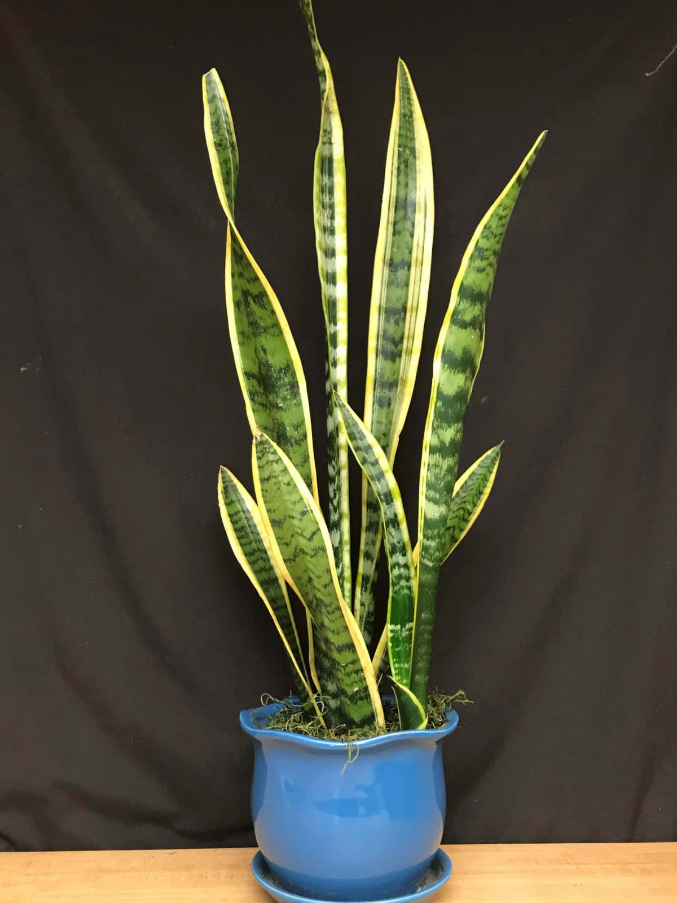

# 🌱 How to Add Plant Images to Plantaria Website

This guide explains how to add real plant images to your Plantaria website to replace the placeholder images.

## 📁 Image File Structure

Your website expects images in the `images/` folder with these specific names:

### 🏠 **Home Page Images**
```
images/
├── hero-plants.jpg          # Main hero section image
├── product1.jpg             # Set Of 5 - Indoor Plants & Money Plant & Bamboo
├── product2.jpg             # Buy any 3 Products for 2999/-
├── product3.jpg             # Set Of 5 - Golden Money & Lucky Jade
├── product4.jpg             # Low Indoor Plant Combo
├── product5.jpg             # Set Of 3 Air Purifying Plants
├── product6.jpg             # Premium Indoor Plant Collection
└── product7.jpg             # Beautiful Succulent Collection
```

### 🌿 **Products Page Images**
```
images/
├── snake-plant.jpg          # Snake Plant (Sansevieria)
├── money-plant.jpg          # Money Plant (Pothos)
├── rubber-plant.jpg         # Rubber Plant (Ficus Elastica)
├── peace-lily.jpg           # Peace Lily
├── rose-plant.jpg           # Rose Plant
├── anthurium.jpg            # Anthurium
├── jade-plant.jpg           # Jade Plant
├── aloe-vera.jpg            # Aloe Vera
├── bamboo.jpg               # Lucky Bamboo
├── palm-plant.jpg           # Areca Palm
├── spider-plant.jpg         # Spider Plant
└── zz-plant.jpg             # ZZ Plant
```

## 📸 **Image Requirements**

### **Recommended Specifications:**
- **Format:** JPG or PNG
- **Size:** 800x600 pixels (4:3 ratio) or 1200x900 pixels
- **File Size:** Under 500KB each for fast loading
- **Quality:** High resolution, well-lit, clear focus

### **Image Guidelines:**
- ✅ **Clean background** (white or neutral)
- ✅ **Good lighting** (natural light preferred)
- ✅ **Sharp focus** on the plant
- ✅ **Show the pot/container** 
- ✅ **Multiple angles** if possible
- ❌ Avoid blurry or dark images
- ❌ Don't use copyrighted images

## 🔧 **How to Add Images**

### **Method 1: Replace Files Directly**
1. **Take or download** your plant images
2. **Rename them** to match the required names (e.g., `snake-plant.jpg`)
3. **Copy them** to the `images/` folder
4. **Replace** the existing placeholder files

### **Method 2: Update HTML (if using different names)**
If you want to use different image names, update the HTML files:

**In index.html:**
```html
<!-- Change this -->


<!-- To this (with your image name) -->

```

**In products.html:**
```html
<!-- Change this -->


<!-- To this (with your image name) -->

```

## 📱 **Image Optimization Tips**

### **Before Uploading:**
1. **Resize images** to recommended dimensions
2. **Compress images** using tools like:
   - TinyPNG (https://tinypng.com/)
   - ImageOptim (for Mac)
   - GIMP (free image editor)
3. **Convert to JPG** for smaller file sizes

### **Online Image Sources:**
If you need stock plant images:
- **Unsplash** (https://unsplash.com/s/photos/plants) - Free
- **Pexels** (https://www.pexels.com/search/plants/) - Free
- **Pixabay** (https://pixabay.com/images/search/plants/) - Free
- Make sure to check license requirements

## 🛠️ **Step-by-Step Process**

### **Step 1: Prepare Your Images**
```bash
# Create a folder for your plant photos
📁 my-plant-photos/
├── 📷 snake-plant-photo.jpg
├── 📷 money-plant-photo.jpg
├── 📷 jade-plant-photo.jpg
└── 📷 ...
```

### **Step 2: Rename Images**
Rename your images to match the website requirements:
```
snake-plant-photo.jpg → snake-plant.jpg
money-plant-photo.jpg → money-plant.jpg
jade-plant-photo.jpg → jade-plant.jpg
```

### **Step 3: Copy to Website**
```bash
# Copy renamed images to the website images folder
📁 plantaria-website/
└── 📁 images/
    ├── 🖼️ snake-plant.jpg     ✅ (your image)
    ├── 🖼️ money-plant.jpg     ✅ (your image)
    ├── 🖼️ jade-plant.jpg      ✅ (your image)
    └── 🖼️ ...
```

### **Step 4: Test the Website**
1. **Open** `index.html` in your browser
2. **Check** if images load correctly
3. **Test** the shopping cart with real images
4. **Verify** images appear in WhatsApp messages

## 🎨 **Hero Section Image**

The main hero image (`hero-plants.jpg`) should be:
- **Dimensions:** 1200x800 pixels (landscape)
- **Content:** Beautiful arrangement of plants
- **Style:** Professional, clean, inspiring
- **Text space:** Leave room for the "KEEP THE OXYGEN SUPPLY" text overlay

## 🔍 **Troubleshooting**

### **Images Not Showing?**
1. **Check file names** - must match exactly (case-sensitive)
2. **Check file format** - use .jpg or .png
3. **Check file location** - must be in `images/` folder
4. **Refresh browser** - clear cache (Ctrl+F5)

### **Images Too Large?**
1. **Compress images** using online tools
2. **Resize to recommended dimensions**
3. **Convert PNG to JPG** for smaller size

### **Wrong Image Proportions?**
The CSS will automatically crop/resize images, but for best results:
- **Product images:** 4:3 ratio (800x600)
- **Hero image:** 3:2 ratio (1200x800)

## 📋 **Quick Checklist**

Before going live, ensure:
- [ ] All required images are added
- [ ] Images are properly named
- [ ] File sizes are under 500KB each
- [ ] Images load correctly on all pages
- [ ] Shopping cart shows correct images
- [ ] WhatsApp messages include images
- [ ] Website loads quickly

## 💡 **Pro Tips**

1. **Batch Processing:** Use image editing software to resize/rename multiple images at once
2. **Backup:** Keep original high-resolution images as backups
3. **Consistency:** Use similar lighting and background for all product images
4. **Mobile Testing:** Check how images look on mobile devices
5. **SEO:** Use descriptive alt text for better search engine optimization

## 🆘 **Need Help?**

If you encounter issues:
1. **Check browser console** (F12) for error messages
2. **Verify file paths** are correct
3. **Test with one image first** before adding all
4. **Use placeholder URLs** temporarily if needed

---

**Happy planting! 🌱** Your Plantaria website will look amazing with real plant images!