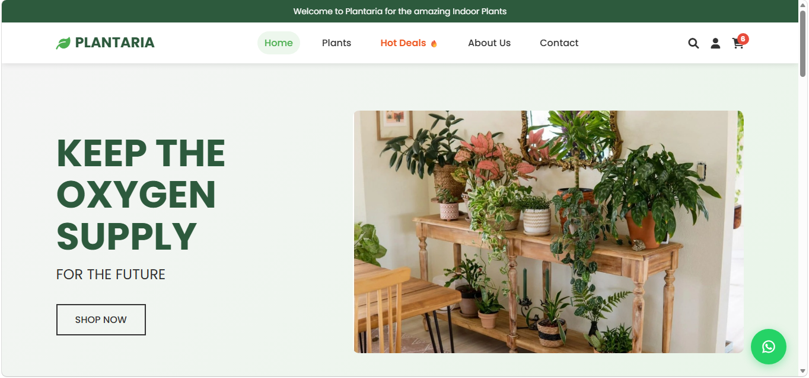

# Plantaria-website
Plantaria is a responsive front-end plant store website built with HTML, CSS, and JavaScript. It features a modern UI, product showcase, mobile-friendly design, and interactive elements. The project highlights practical front-end skills and presents a portfolio-ready e-commerce style interface.
<h2 align="center">Home Page UI</h2>
<p align="center">
  
</p>
# Plantaria - Online Plant Store
A beautiful, responsive website for Plantaria, an online plant store serving the Pakistani market.

## Project Overview
Plantaria is designed to be a user-friendly, visually appealing HTML-based website that showcases plants and creates an online presence for plant lovers in Pakistan.

## Features
### 🏠 Home Page
- Brand introduction with hero banner
- Featured products showcase
- "Keep the Oxygen Supply for the Future" theme
- Product grid with pricing in PKR
- Special offers and deals

### 🌱 Products Page
- Plant categories: Indoor, Outdoor, Flowering, Non-flowering, Succulents
- Interactive filtering system
- Detailed product cards with descriptions
- Add to cart functionality
- Responsive product grid

### ℹ️ About Us Page
- Brand story and mission
- Company values with icons
- Why choose Plantaria
- Focus on Pakistani market expertise

### 📞 Contact Page
- Contact form with WhatsApp integration
- Business information and hours
- Social media links
- Quick order via WhatsApp
- Location and contact details

## Technical Features
### 🎨 Design
- Modern, clean design inspired by the provided screenshot
- Green color scheme reflecting nature theme
- Responsive design for all devices
- Professional typography using Poppins font
- Font Awesome icons throughout

### 🛠️ Functionality
- Interactive product filtering
- Shopping cart with item counter
- Contact form with WhatsApp integration
- Smooth scrolling and animations
- Mobile-responsive navigation
- Search functionality

### 📱 Mobile Optimization
- Fully responsive design
- Touch-friendly interface
- Optimized for Pakistani mobile users
- Fast loading times

## File Structure
plantaria/
├── index.html          # Home page
├── products.html       # Products catalog
├── about.html         # About us page
├── contact.html       # Contact page
├── styles.css         # Main stylesheet
├── script.js          # JavaScript functionality
├── images/            # Product and hero images
└── README.md          # This file
```

## Setup Instructions
1. **Clone or download** all files to your web server
2. **Add product images** to the `images/` folder:
   - hero-plants.jpg (for hero section)
   - product1.jpg through product7.jpg (for home page)
   - Individual product images for products page
3. **Update contact information** in contact.html and WhatsApp links
4. **Customize** colors, fonts, or content as needed
5. **Test** on different devices and browsers

## Required Images
To complete the website, add these images to the `images/` folder:

### Home Page
- `hero-plants.jpg` - Hero section image
- `product1.jpg` to `product7.jpg` - Featured products

### Products Page
- `snake-plant.jpg`
- `money-plant.jpg`
- `rubber-plant.jpg`
- `peace-lily.jpg`
- `rose-plant.jpg`
- `anthurium.jpg`
- `jade-plant.jpg`
- `aloe-vera.jpg`
- `bamboo.jpg`
- `palm-plant.jpg`
- `spider-plant.jpg`
- `zz-plant.jpg`

## Customization
### Colors
The main colors can be changed in `styles.css`:
- Primary green: `#4CAF50`
- Dark green: `#2d5a3d`
- Accent colors as needed

### Content
- Update plant names, prices, and descriptions
- Modify contact information
- Change WhatsApp number (+92 300 123 4567)
- Update social media links

### Features to Add
- Payment gateway integration
- User accounts and login
- Shopping cart persistence
- Order tracking
- Plant care blog
- Customer reviews

## Browser Support
- Chrome (recommended)
- Firefox
- Safari
- Edge
- Mobile browsers

## Pakistani Market Focus
- Prices in Pakistani Rupees (PKR)
- WhatsApp integration for easy ordering
- Local contact information
- Climate-appropriate plant recommendations
- Urdu language support (can be added)

## Performance
- Optimized CSS and JavaScript
- Compressed images recommended
- Fast loading times
- SEO-friendly structure

## Support
For technical support or customization requests, contact the development team.
**Plantaria** - Bringing timeless nature into modern spaces across Pakistan 🌱

